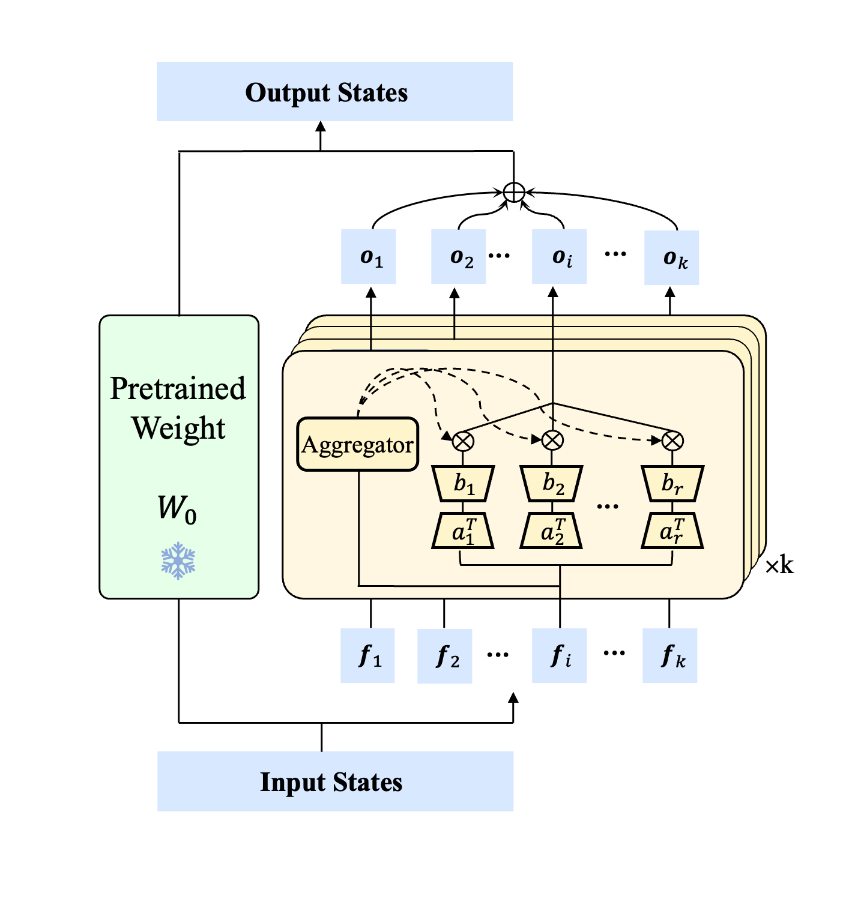

# DMLoRA: Dynamic Multi-Subspace Low-Rank Adaptation

**Authors**: Cong Jiang; Fangzhi Zhu; Xiaowei Chen; Junxiong Zhu; Bo Zheng; Yifeng Wang; Zheng Zhang

**TL; DR**: We propose DMLoRA, a dynamic multi-subspace adaptation of LoRA that enhances parameter-efficient fine-tuning through input-dependent nonlinear transformations. Unlike conventional LoRA's static low-rank updates, our method partitions input features into multiple chunks and processes them in distinct subspaces with dynamically generated weights. This architecture enables adaptive feature transformation across fine-grained subspaces while maintaining parameter efficiency.



### Environment

```
conda create -n dmlora python=3.10
source activate dmlora
pip install -r requirements.txt
```


### Dataset

Get the train data and benchmarks from [here](https://github.com/AGI-Edgerunners/LLM-Adapters)


### Train and Inference

As I modify the PEFT lora code directly, the `adapter_name` should be set to `lora`. 

```bash
# scripts/train-dmlora.sh

head=8
rank=8
alpha=16

model_p_or_n=meta-llama/Meta-Llama-3-8B
model_path=checkpoints/llama3-lora-r$rank-a$alpha-subspace$head

mkdir -p $model_path

python -u finetune.py \
  --base_model $model_p_or_n \
  --data_path 'ft-training_set/commonsense_170k.json' \
  --output_dir $model_path \
  --batch_size 16 \
  --micro_batch_size 16 \
  --num_epochs 3 \
  --learning_rate 3e-4 \
  --cutoff_len 256 \
  --val_set_size 120 \
  --eval_step 80 \
  --save_step 80 \
  --adapter_name lora \
  --lora_r $rank \
  --lora_alpha $alpha \
  --lora_head $head \
  --target_modules "["q_proj", "k_proj", "v_proj", "up_proj", "down_proj"]"
```


### Acknowledge

This code is modifed based on the [LLM-Adapters](https://github.com/AGI-Edgerunners/LLM-Adapters), we thank for their efforts.